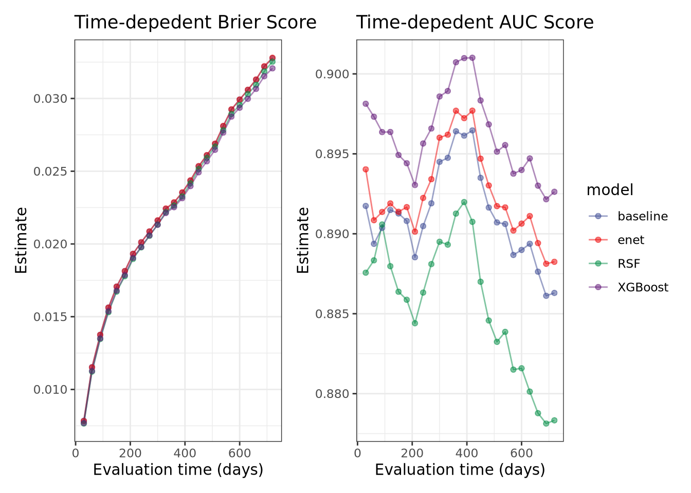
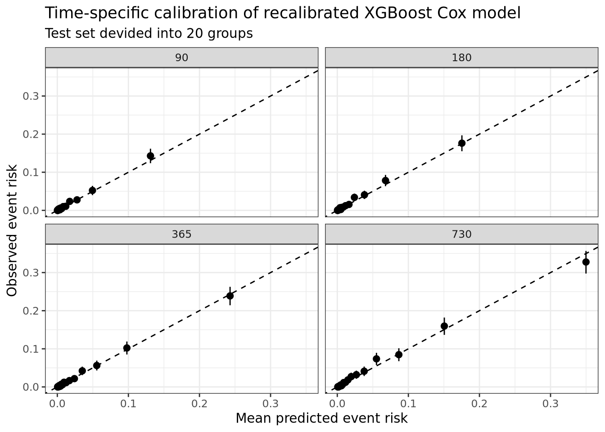
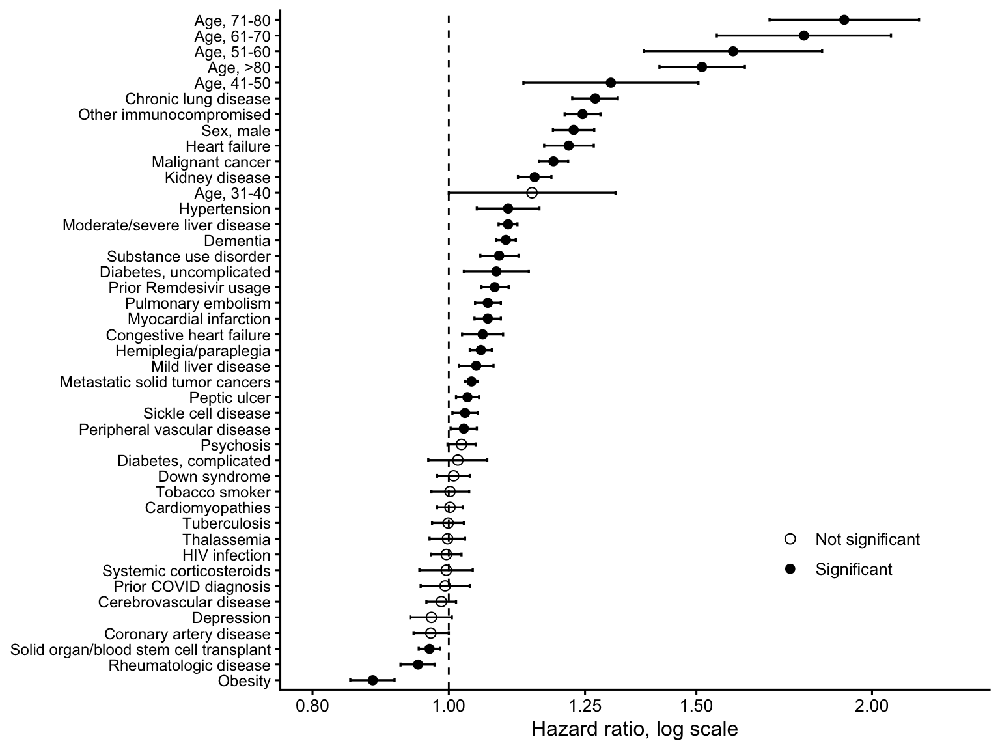
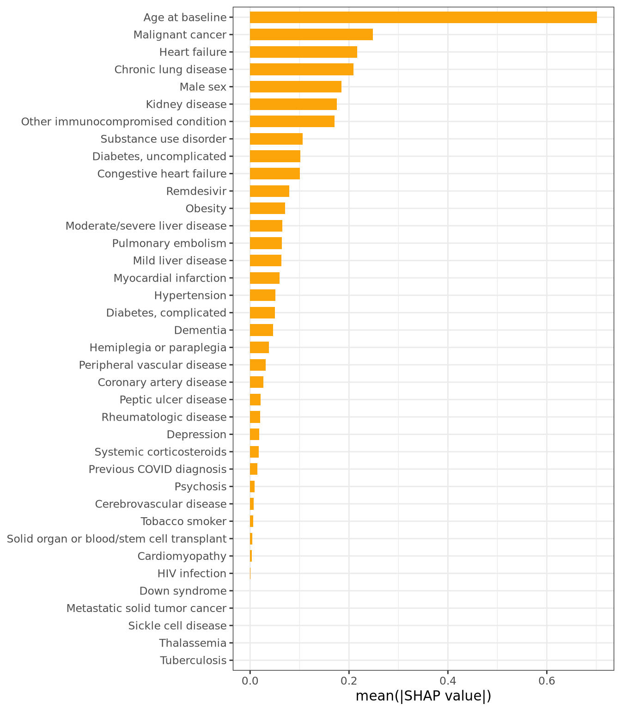
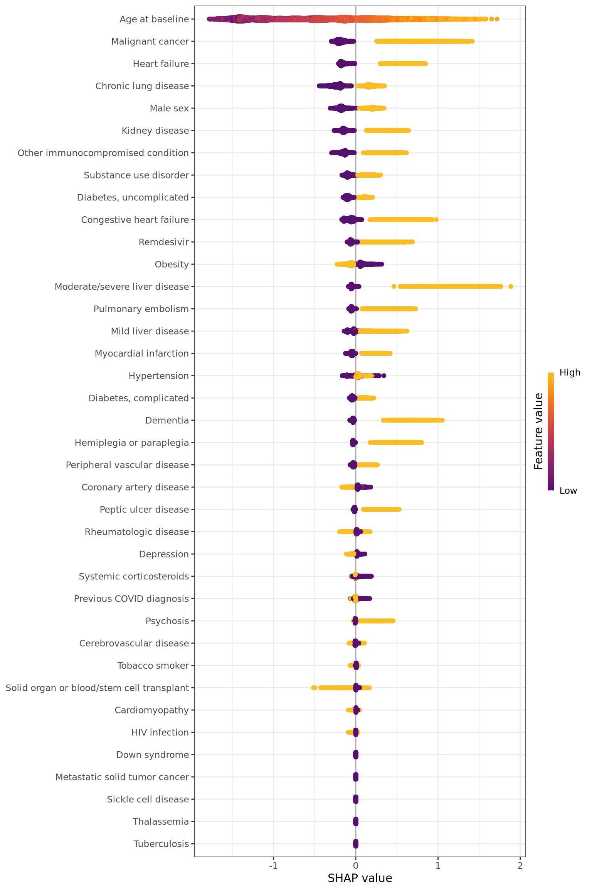
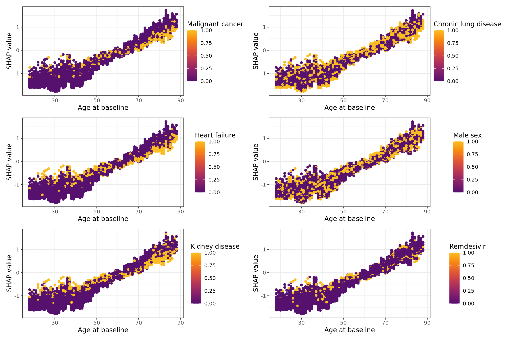
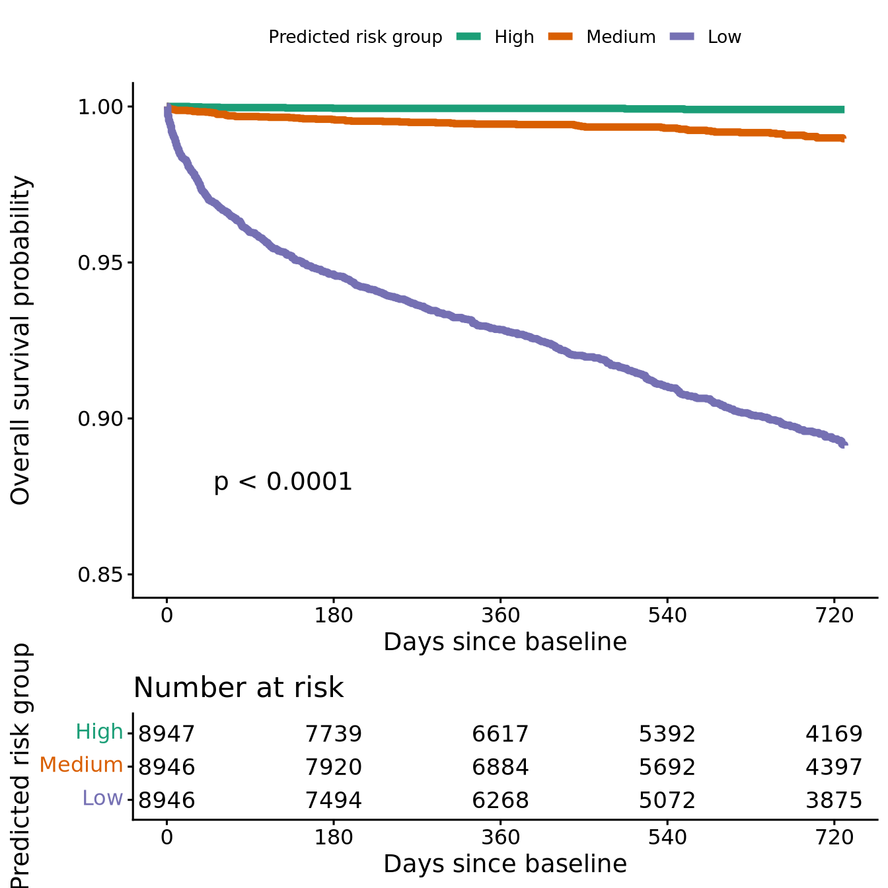
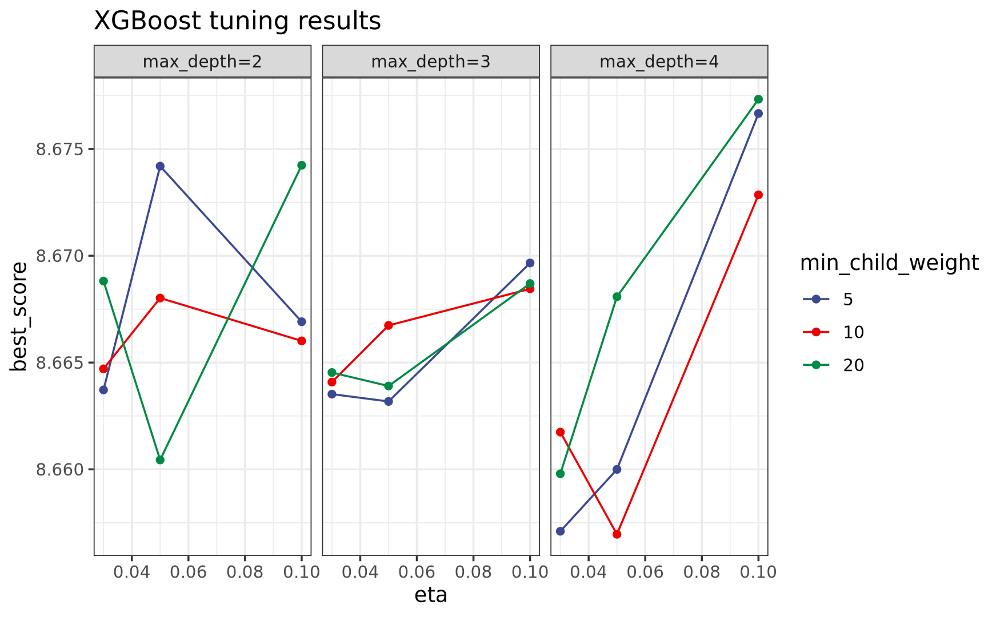
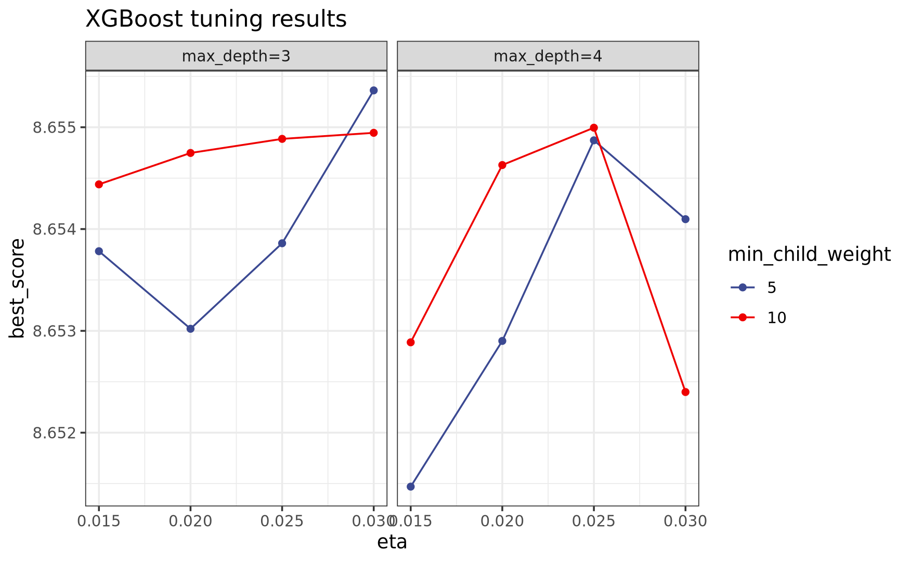
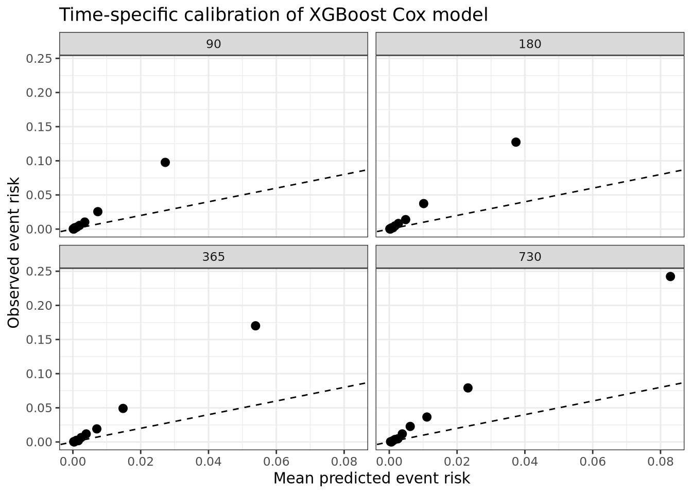

# Please leave your feedback

Thank you for visiting our poster. 

We welcome feedback on the study design, model interpretation, and potential clinical applications.

[Leave anonymous feedback](https://forms.gle/ZqsvhNpAvZHgNRwS6){.big-link}


# Authors

Shuntai Zhou, PhD^1^; Alexander Toppo, MD, MPH^2^; Serena S. Dasani, MD, MBA^3^; Prakash R. Ganesh, MD, MPH^4^; Claire Han, PhD, DNP, RN^5^; Nikki Reyes, PhD, MPH^6^;  Mahbubul (Shaon) Hasan, PhD^7^

^1^University of North Carolina at Chapel Hill, Chapel Hill, NC; 

^2^Texas Tech University Health Sciences Center, El Paso, TX;   

^3^University of Texas Health Science Center at Houston, Houston, TX; 

^4^Case Western Reserve University School of Medicine, Cleveland, OH; 

^5^The Ohio State University College of Nursing, Columbus, OH; 

^6^University of Miami, Miami, FL; 

^7^Axle Informatics, Rockville, MD


# Study overview

Long COVID (post‑acute sequelae of SARS‑CoV‑2 infection; **PASC**) is heterogeneous, frequently disabling, and associated with persistent multisystem disease in some patients. While preexisting comorbidities increase acute COVID‑19 severity, their relative, clinically usable contributions to **longer-term mortality** risk among patients who develop Long COVID remain incompletely quantified in large, contemporary electronic health record (EHR) cohorts. We will develop and validate an interpretable machine learning model using **pre-existing comorbidities** for **2-year all-cause mortality** in a Long COVID cohort, helping identify patients who may benefit from proactive follow-up, rehabilitation planning, and goals-of-care discussions.


# Introduction

## Research Question

In adults (≥18 years) in the N3C Data Enclave who meet an EHR-based Long COVID (PASC) definition (e.g., U09.9 and/or N3C/RECOVER computable phenotypes), can a model using pre‑existing comorbidities (plus baseline covariates such as age, sex,  vaccination status, calendar‑time/variant era, and observability measures) be developed and internally validated to predict 2‑year all‑cause mortality measured from the PASC index date, with good discrimination, calibration, and clinical utility?

A single, interpretable comorbidity score could support patient-centered risk stratification shortly after diagnosis—helping clinicians identify individuals who may benefit from closer follow-up, optimization of chronic disease management, and shared decision-making about care intensity. In addition to mortality (a definitive outcome for patients and families), we will assess clinically meaningful secondary outcomes that reflect recovery and health system burden, including 30‑ and 90‑day mortality, hospitalization/ICU admission, ED visits and readmissions, and post‑acute health care utilization over 6–24 months (as proxies for functional decline and ongoing morbidity).


## Literature gap

-   Clinical context: Post‑acute sequelae of SARS‑CoV‑2 infection (PASC/Long COVID) is common and heterogeneous, and higher‑severity phenotypes may carry sustained excess mortality risk—supporting longer follow‑up horizons and careful handling of competing risks.
-   Why prediction (not association): Many post‑COVID studies focus on describing sequelae; fewer develop calibrated, survival‑aware prognostic models that estimate individualized 24‑month mortality risk suitable for clinical risk stratification.
-   Phenotype limitations: EHR ascertainment of PASC (e.g., ICD-10-CM U09.9) is incomplete and site-/time-variable; models that treat PASC as the primary endpoint can be sensitive to coding intensity and follow-up differences. Mortality is more reliably captured, enabling more transportable prediction.
-   Methodological gap: Many prediction studies report AUC only; fewer evaluate calibration at prespecified horizons and decision‑analytic utility (e.g., net benefit). A large, harmonized EHR resource (N3C) enables time‑stratified validation, recalibration, and subgroup assessment.

Together, these gaps motivate a mortality‑focused, comorbidity‑weighted time‑to‑event prediction approach in N3C with explicit attention to follow‑up/observability, calibration at 6/12/24 months, and clinical utility, while treating PASC outcomes as exploratory rather than the primary endpoint.

## Clinical importance

Long COVID is not only a heterogeneous symptom syndrome but also a measurable burden of morbidity and disability, with sustained decrements in health-related quality of life and work ability in population-based cohorts. This burden, together with evidence of persistent multisystem sequelae and non-trivial mortality risk in higher-severity groups, supports a pragmatic approach to early risk stratification at diagnosis to target follow-up, rehabilitation, and specialist evaluation to those most likely to experience prolonged impairment.

# Objectives

- Define an EHR-based Long COVID (PASC) cohort in N3C (U09.9 and/or N3C/RECOVER computable phenotypes), specify eligibility/observability rules, and ascertain all‑cause mortality through 24 months after PASC index, including competing risks considerations.
- Develop and internally validate prediction models using pre‑existing comorbidities (and selected baseline characteristics) to predict 2‑year mortality after PASC index, and translate the best‑performing model into an interpretable model. 
- Assess discrimination, calibration, and clinical utility of the final model.

# Population

The analytic cohort will include adults (≥18 years) in N3C who meet an EHR-based Long COVID (PASC) definition (e.g., ICD‑10‑CM U09.9 and/or N3C/RECOVER computable phenotypes) with adequate pre‑index history and follow‑up. The primary analyses will predict 2‑year all‑cause mortality after the PASC index date.

## Eligibility Criteria
- Age ≥ 18 y/o
- Confirmed PASC diagnosis
- Has at least one post-PASC follow-up visit, unless they died on the same day of PASC diagnosis
- 
## ⁠Ineligibility criteria
- Missing mortality outcome
- Prevalent PASC
- Gender unknown or unrecognized fields
- Missing age
- PASC diagnosis after death

::: {.callout-note}
1. Pre-diagnosis of COVID exists in only ~50% of participants with PASC. It is not unusual, given that many people self-diagnose COVID
2. Prevalent PASC means PASC diagnosis at very first clinical record
3. Tree-based model cannot take 0 censor day (no follow-ups for people who did not die on the same day of PASC diagnosis), thus, these participants (~3% were excluded)+1 event day was added to people who died on the same day of PASC diagnosis
:::


## Cohort Construction (Long COVID/PASC)

We constructed the Long COVID cohort using pre-specified, EHR-based phenotypes available in N3C. The primary phenotype were (i) an ICD‑10‑CM U09.9 diagnosis and/or (ii) an N3C/RECOVER computable phenotype for Long COVID. The PASC index date was defined as the first qualifying event meeting the chosen phenotype definition and will serve as time zero for all post‑PASC outcomes.

Pre‑existing comorbidities were ascertained using diagnoses recorded before the index infection date (a prespecified lookback window, with most conditions having lifetime lookback windows). Several pre-existing exposures (including tobacco usage, previous COVID diagnosis, usage of corticosteroids and/or remdesivir) were also be recorded. We defined observability using EHR data-density/utilization rules (e.g., evidence of encounters in the baseline period and post-index follow-up) and censored follow-up at the last known observable date to mitigate differential follow-up bias.

# Key Variables

## Index date (time zero): 

PASC index date—the first qualifying Long COVID event (e.g., U09.9 diagnosis and/or N3C/RECOVER phenotype-defined encounter).

## Outcomes:

Primary outcome (prognostic target): All‑cause mortality through 24 months after PASC index (time‑to‑event). The time origin is the PASC index date; censoring occurs at the last known contact/observability, a transfer out of contributing systems, or study end.
 
## Predictors:

We pre-specified predictors captured in the EHR, including:

- pre‑existing comorbidities (chronic condition groupings available in N3C), assessed prior to the index infection date, with individual lookback windows.
- selected exposures (including tobacco usage, previous COVID diagnosis, usage of corticosteroids and/or remdesivir).
- Demographics: age, sex, etc. 


## Predictor selection 

| Comorbidity/Exposure | Explanation | Include as predictors | Lookback window |
|---|---|---|---|
| OBESITY |  | Y | 2 years |
| TOBACCOSMOKER | Need discussion because the concept set is rich but this indicator is not informative | Y | Lifetime |
| PREGNANCY | Pregnancy. Still have some males with this status being TRUE | N | Lifetime |
| SOLIDORGANORBLOODSTEMCELLTRANSPLANT | Solid Organ or Blood Stem Cell Transplant | Y | Lifetime |
| LONGCOVIDCLINICVISIT | Indicator that the patient ever had a Long COVID specialty clinic visit. This is an exposure after Long COVID diagnosis. Including it after PASC diagnosis may cause future information leakage. | N | After PASC diagnosis |
| CARDIOMYOPATHIES | Cardiomyopathies | Y | Lifetime |
| CEREBROVASCULARDISEASE | Cerebrovascular Disease | Y | Lifetime |
| CHRONICLUNGDISEASE | Chronic Lung Disease | Y | Lifetime |
| CONGESTIVEHEARTFAILURE | Congestive Heart Failure | Y | Lifetime |
| CORONARYARTERYDISEASE | Coronary Artery Disease | Y | Lifetime |
| DEMENTIA | Dementia | Y | Lifetime |
| DEPRESSION | Depression | Y | Lifetime |
| DIABETESCOMPLICATED | Diabetes Complicated | Y | Lifetime |
| DIABETESUNCOMPLICATED | Diabetes Uncomplicated | Y | Lifetime |
| DOWNSYNDROME | Down's Syndrome | Y | Lifetime |
| HEARTFAILURE | Heart Failure | Y | Lifetime |
| HEMIPLEGIAORPARAPLEGIA | Hemiplegia or paraplegia | Y | Lifetime |
| HIVINFECTION | HIV Infection | Y | Lifetime |
| HYPERTENSION | Hypertension | Y | Lifetime |
| KIDNEYDISEASE | Kidney Disease | Y | Lifetime |
| LL_COVID_diagnosis | N3C COVID diagnosis. Interesting covariate; could indicate that previous COVID diagnosis was not recorded in N3C. | Y |  |
| LL_MISC | Not relevant | N |  |
| LONGCOVID | PASC diagnosis; should not include as a comorbidity | N |  |
| MALIGNANTCANCER | Malignant Cancer | Y | Lifetime |
| METASTATICSOLIDTUMORCANCERS | Metastatic Solid Tumor Cancers | Y | Lifetime |
| MILDLIVERDISEASE | Mild Liver Disease | Y | Lifetime |
| MODERATESEVERELIVERDISEASE | Moderate Severe Liver Disease | Y | Lifetime |
| MYOCARDIALINFARCTION | Myocardial Infarction | Y | Lifetime |
| OTHERIMMUNOCOMPROMISED | Other Immunocompromised | Y | Lifetime |
| PEPTICULCER | Peptic Ulcer | Y | 2 years |
| PERIPHERALVASCULARDISEASE | Peripheral Vascular Disease | Y | Lifetime |
| PSYCHOSIS | Psychosis | Y | Lifetime |
| PULMONARYEMBOLISM | Pulmonary Embolism | Y | Lifetime |
| RHEUMATOLOGICDISEASE | Rheumatologic Disease | Y | Lifetime |
| SICKLECELLDISEASE | Sickle Cell Disease | Y | Lifetime |
| SUBSTANCEUSEDISORDER | Substance Use Disorder | Y | 2 years |
| THALASSEMIA | Thalassemia | Y | Lifetime |
| TUBERCULOSIS | Tuberculosis | Y | Lifetime |
| REMDESIVIR | Remdesivir usage; drug exposure | Y | Lifetime, but probably not important |
| SYSTEMICCORTICOSTEROIDS | Systemic Corticosteroids | Y | Lifetime |
| PCR_AG_Pos |  | No |  |
| PCR_AG_Neg |  | No |  |
| Antibody_Pos |  | No |  |
| Antibody_Neg |  | No |  |
| BMI_rounded | BMI; large amount of missing data | No |  |
| patient_death_at_visit | Outcome variable | No |  |

: Comorbidity and exposure variables {.striped .hover .sm}

# Data Analysis Methods

All analyses were conducted using R. 

## Data splitting 

The analytic dataset was randomly divided into training and testing sets (80%-20% split), stratified by `event` (death), with the training set used for model development, hyperparameter tuning, and internal resampling, and the held-out testing set used only for final model evaluation. Event time was defined as the number of days from the index date to the outcome of interest (death) or censoring. Participants without the event were censored at the last available follow-up time. Survival outcomes were represented using time-to-event and event indicator variables.

## Modeling process

We developed and compared four survival modeling approaches: 

- a baseline Cox proportional hazards model, 
- a penalized Cox proportional hazards model,
- a random survival forest model,
- and an XGBoost survival model. 
  
The baseline Cox model was used as a conventional statistical reference model. Penalized Cox regression was fit using elastic net regularization to allow shrinkage and variable selection in the presence of correlated predictors. Random survival forest was used as a nonparametric ensemble method capable of modeling nonlinear effects and higher-order interactions. XGBoost survival models were fit using a Cox partial likelihood objective and were evaluated as the primary machine learning approach because of their ability to capture complex nonlinear predictor effects while maintaining computational efficiency.

Model training and preprocessing were performed within a reproducible modeling workflow. Categorical predictors were encoded using indicator variables as needed. Continuous variables were retained as continuous predictors when appropriate to avoid information loss from arbitrary categorization. Missing values were handled according to the prespecified preprocessing strategy before model fitting. One variable BMI with missing ~50% values was excluded in the analysis. For models requiring normalized predictors, such as penalized Cox regression, numeric variables were centered and scaled within the training data, and the same preprocessing parameters were applied to the testing data. Tree-based models were fit without normalization because they are invariant to monotonic scaling of individual predictors.

## Hyperparameter tuning 

Hyperparameters for the machine learning models were tuned using resampling within the training set.

Penalized Cox regression was fit using elastic net regularization to allow both coefficient shrinkage and variable selection in the presence of correlated predictors. The elastic net mixing parameter and regularization penalty were tuned using cross-validation within the training set. The mixing parameter controlled the relative contribution of L1 and L2 penalties, while the penalty parameter controlled the overall strength of regularization. The final model was refit using the optimal combination of tuning parameters prior to evaluation on the held-out testing set.

For XGBoost, tuning focused on parameters controlling learning rate, tree depth, minimum child weight, subsampling, column sampling, and the number of boosting rounds. Early stopping or resampling-based performance was used to select the final number of boosting iterations. Hyperparameters were selected by minimizing the cross-validated negative log partial likelihood under the Cox proportional hazards objective. The final XGBoost model was refit using the selected hyperparameter combination and corresponding number of rounds before evaluation on the held-out testing set.

Random survival forest hyperparameters, including the number of variables considered at each split and node-size-related parameters, were tuned similarly within the training set. 

## Model evaluation 

Model performance was evaluated on the held-out testing set using discrimination and prediction-error metrics appropriate for censored survival data. Discrimination was assessed using concordance-based measures (**c-index**) and time-dependent area under the receiver operating characteristic curve (**ROC-AUC**) at clinically relevant follow-up times. Prediction error was assessed using time-dependent **Brier scores** and integrated Brier scores when model-based survival probabilities were available. Because some survival implementations, particularly XGBoost with a Cox objective, generate relative risk scores rather than direct survival probability estimates, evaluation metrics were selected according to the scale of the model output. For models producing survival probability curves, predicted survival probabilities were evaluated across prespecified time points. For models producing risk scores, discrimination-based metrics were prioritized unless an additional baseline hazard or calibration step was used to convert risk scores to absolute risk estimates.

## Calibration and recalibration

Because the XGBoost Cox model estimates relative risk rather than absolute survival probability, we performed Cox recalibration to convert the model output into time-specific absolute event risk. The final XGBoost model was first used to generate an individual-level log-risk score, denoted as $lp_{\mathrm{xgb}}$. We then fitted a Cox proportional hazards recalibration model in the training set using $lp_{\mathrm{xgb}}$ as the sole predictor: $h_i(t) = h_0(t)\exp(\beta_{\mathrm{cal}} lp_{\mathrm{xgb},i})$, where $\beta_{\mathrm{cal}}$ is the recalibration coefficient estimated from the training data and $h_0(t)$ is the baseline hazard. The corresponding baseline cumulative hazard, $H_0(t)$, was estimated from this recalibration Cox model. For each individual, the recalibrated linear predictor was calculated as $\eta_i=\beta_{\mathrm{cal}}lp_{\mathrm{xgb},i}$, and the time-specific survival probability was estimated as $S_i(t) = \exp[-H_0(t)\exp(\eta_i)]$. Absolute event risk at time $t$ was then calculated as $1\ -\ S_i(t)$. Calibration was evaluated in the held-out test set by grouping individuals according to predicted event risk and comparing mean predicted risk with Kaplan–Meier observed event risk within each group at prespecified time points.

All final model comparisons were based on the held-out testing set to avoid optimistic performance estimates. The overall analytic strategy was designed to compare conventional and machine learning survival models, identify whether flexible nonlinear models improved predictive performance, and interpret the best-performing model in a clinically and biologically meaningful manner.

# Results 

## Data lock out date

May 2026

## Baseline Date
Range: Jan 2020 to March 2026
Median: 2022-08-16
IQR: 2022-02-14 to 2023-05-19


## Cohort selection flow diagram

N3C database: ~21,000,000 participants

          │
          ▼

PASC diagnosis and age at baseline ≥18 years: 143,396 participants

          │
          ├── Excluded prevalent PASC: 6,057
          ├── Excluded PASC diagnosis after death: 20
          ├── Excluded unknown/unrecognized gender: 46
          └── Excluded no follow-up / censor date = 0: 3,078
          │
          ▼
          
Final analytic cohort: **134,195 participants**

## Table 1. Baseline clinical and non-clinical characteristics of the study participants. 

| Variable | Level/Statistic | Overall (N=134,195) |
|---|---:|---:|
| age_at_baseline | Count | 134,195 |
| age_at_baseline | Median | 55.000 |
| age_at_baseline | Q1, Q3 | 42.000, 67.000 |
| age_cat | 18-30 | 11,460 (8.5%) |
| age_cat | 31-40 | 18,262 (13.6%) |
| age_cat | 41-50 | 24,746 (18.4%) |
| age_cat | 51-60 | 28,689 (21.4%) |
| age_cat | 61-70 | 27,476 (20.5%) |
| age_cat | 71-80 | 18,404 (13.7%) |
| age_cat | 80+ | 5,158 (3.8%) |
| sex | FEMALE | 89,067 (66.4%) |
| sex | MALE | 45,128 (33.6%) |
| times_day | Count | 134,195 |
| times_day | Median | 672.000 |
| times_day | Q1, Q3 | 347.000, 731.000 |
| event_censored | TRUE | 4,319 (3.2%) |
| TOBACCOSMOKER | TRUE | 20,016 (14.9%) |
| SOLIDORGANORBLOODSTEMCELLTRANSPLANT | TRUE | 911 (0.7%) |
| CARDIOMYOPATHIES | TRUE | 6,527 (4.9%) |
| CEREBROVASCULARDISEASE | TRUE | 9,956 (7.4%) |
| CHRONICLUNGDISEASE | TRUE | 47,369 (35.3%) |
| CONGESTIVEHEARTFAILURE | TRUE | 10,598 (7.9%) |
| CORONARYARTERYDISEASE | TRUE | 17,426 (13.0%) |
| DEMENTIA | TRUE | 2,168 (1.6%) |
| DEPRESSION | TRUE | 42,465 (31.6%) |
| DIABETESCOMPLICATED | TRUE | 20,676 (15.4%) |
| DIABETESUNCOMPLICATED | TRUE | 29,623 (22.1%) |
| DOWNSYNDROME | TRUE | 66 (0.0%) |
| HEARTFAILURE | TRUE | 15,759 (11.7%) |
| HEMIPLEGIAORPARAPLEGIA | TRUE | 2,069 (1.5%) |
| HIVINFECTION | TRUE | 877 (0.7%) |
| HYPERTENSION | TRUE | 63,738 (47.5%) |
| KIDNEYDISEASE | TRUE | 17,276 (12.9%) |
| LL_COVID_diagnosis | TRUE | 75,118 (56.0%) |
| MALIGNANTCANCER | TRUE | 15,137 (11.3%) |
| METASTATICSOLIDTUMORCANCERS | TRUE | 90 (0.1%) |
| MILDLIVERDISEASE | TRUE | 14,634 (10.9%) |
| MODERATESEVERELIVERDISEASE | TRUE | 1,808 (1.3%) |
| MYOCARDIALINFARCTION | TRUE | 7,840 (5.8%) |
| OTHERIMMUNOCOMPROMISED | TRUE | 20,555 (15.3%) |
| PERIPHERALVASCULARDISEASE | TRUE | 8,098 (6.0%) |
| PSYCHOSIS | TRUE | 1,493 (1.1%) |
| PULMONARYEMBOLISM | TRUE | 5,992 (4.5%) |
| RHEUMATOLOGICDISEASE | TRUE | 16,450 (12.3%) |
| SICKLECELLDISEASE | TRUE | 172 (0.1%) |
| THALASSEMIA | TRUE | 234 (0.2%) |
| TUBERCULOSIS | TRUE | 237 (0.2%) |
| REMDESIVIR | TRUE | 9,396 (7.0%) |
| SYSTEMICCORTICOSTEROIDS | TRUE | 79,157 (59.0%) |
| OBESITY | TRUE | 64,351 (48.0%) |
| PEPTICULCER | TRUE | 2,312 (1.7%) |
| SUBSTANCEUSEDISORDER | TRUE | 28,507 (21.2%) |

: Baseline characteristics of the PASC cohort {.striped .hover .sm}

::: {.callout-important}
**Note**: Age is used at categorical (every 10 years) in all models except XGBoost, in which age was used as a continuous variable.
:::

## Figure 1. Model Performances

**Time dependent Brier Score and Time dependent ROC-AUC Score of models over evaluated time. **

{#fig-id fig-alt="alt"}


## Table 2. Overal model metrics 

| Model | Mean AUC | C-index | IBS |
|---|---:|---:|---:|
| Baseline CoxPH | 0.891 | 0.883 | 0.0231 |
| Enet CoxPH | 0.893 | 0.884 | 0.0228 |
| RSF | 0.886 | 0.878 | 0.0228 |
| **XGBoost** | **0.896** | **0.888** | **0.0227** |

: Model performance comparison {.striped .hover .sm}

::: {.callout-tip}
## How to read this table

- Higher mean AUC and C-index indicate better discrimination, meaning the model more accurately ranks patients from lower to higher risk. 

- Lower IBS indicates better overall prediction accuracy across follow-up time.
:::


## Final model selection

Based on the overall model comparison, XGBoost was selected as the final prediction model because it provided the strongest discriminative performance while maintaining performance comparable to the other approaches in terms of prediction error. The baseline Cox proportional hazards model already performed well, with a time-dependent AUC close to that of the penalized Cox model and XGBoost, indicating that a substantial proportion of the predictive signal could be captured by the prespecified clinical predictors under a relatively simple semi-parametric model. However, XGBoost achieved the highest average time-dependent AUC and C-index among the evaluated models, suggesting improved ability to rank individuals by predicted risk across follow-up time. In contrast, the random survival forest showed lower discrimination despite similar time-dependent Brier scores. The Brier score trajectories were nearly overlapping across models, indicating that overall prediction error and calibration-related performance were broadly similar; therefore, model selection was driven primarily by discrimination. Given its superior AUC and C-index, together with its ability to capture nonlinear effects and higher-order interactions without requiring them to be specified a priori, **XGBoost was chosen as the final model for subsequent interpretation using SHAP analysis.** This choice should be interpreted as an incremental improvement over an already strong CoxPH benchmark rather than a dramatic replacement of the baseline model.

## Figure 2. Final model calibration and recalibration

{#fig-id fig-alt="alt"}

### Recalibration interpretation. 

In the recalibration Cox model, the estimated coefficient for the XGBoost log-risk score was 1.083, indicating that the original XGBoost risk score was mildly compressed on the log-hazard scale. The recalibrated linear predictor was therefore calculated by multiplying the XGBoost log-risk score by this coefficient before combining it with the estimated baseline cumulative hazard to derive absolute survival probabilities. After recalibration, time-specific calibration plots showed good agreement between mean predicted event risk and Kaplan–Meier observed event risk across risk groups at 90, 180, 365, and 730 days. Finer stratification of predicted-risk groups suggested some overestimation of risk in the extreme high-risk tail, particularly at later follow-up times, but overall calibration was substantially improved after recalibration. These results indicate that the final calibrated XGBoost Cox model can be used not only for risk ranking but also for estimating time-specific absolute survival probabilities in comparable future populations.


# Model interpretation 

## Table 3. Baseline CoxPH model inferences (Harzard Ratio, HR)

| Predictor | HR | 95% CI | p-value |
|---|---:|---:|---:|
| Age 71–80 | 1.911 | 1.691–2.160 | <0.001 |
| Age 61–70 | 1.789 | 1.551–2.063 | <0.001 |
| Age 51–60 | 1.593 | 1.376–1.843 | <0.001 |
| Age 80+ | 1.514 | 1.412–1.624 | <0.001 |
| Age 41–50 | 1.304 | 1.130–1.505 | <0.001 |
| Chronic lung disease | 1.271 | 1.224–1.319 | <0.001 |
| Other immunocompromised | 1.245 | 1.209–1.282 | <0.001 |
| Male sex | 1.227 | 1.186–1.269 | <0.001 |
| Heart failure | 1.217 | 1.169–1.268 | <0.001 |
| Malignant cancer | 1.187 | 1.159–1.216 | <0.001 |
| Kidney disease | 1.151 | 1.120–1.183 | <0.001 |
| Age 31–40 | 1.146 | 1.000–1.314 | 0.050 |
| Hypertension | 1.102 | 1.047–1.160 | <0.001 |
| Moderate/severe liver disease | 1.102 | 1.085–1.119 | <0.001 |
| Dementia | 1.098 | 1.081–1.116 | <0.001 |
| Substance use disorder | 1.086 | 1.053–1.121 | <0.001 |
| Diabetes, uncomplicated | 1.081 | 1.025–1.140 | 0.004 |
| Remdesivir use | 1.078 | 1.055–1.103 | <0.001 |
| Pulmonary embolism | 1.066 | 1.044–1.089 | <0.001 |
| Myocardial infarction | 1.066 | 1.043–1.089 | <0.001 |
| Congestive heart failure | 1.057 | 1.022–1.093 | 0.001 |
| Hemiplegia or paraplegia | 1.054 | 1.035–1.073 | <0.001 |
| Mild liver disease | 1.046 | 1.017–1.076 | 0.002 |
| Metastatic solid tumor cancers | 1.038 | 1.027–1.049 | <0.001 |
| Peptic ulcer | 1.031 | 1.012–1.051 | 0.002 |
| Sickle cell disease | 1.027 | 1.006–1.049 | 0.013 |
| Peripheral vascular disease | 1.025 | 1.003–1.047 | 0.024 |
| Psychosis | 1.021 | 0.998–1.045 | 0.071 |
| Diabetes, complicated | 1.015 | 0.967–1.065 | 0.545 |
| Down syndrome | 1.008 | 0.981–1.035 | 0.580 |
| Tobacco smoker | 1.002 | 0.972–1.034 | 0.890 |
| Cardiomyopathies | 1.002 | 0.981–1.023 | 0.865 |
| Tuberculosis | 0.999 | 0.973–1.025 | 0.911 |
| Thalassemia | 0.998 | 0.969–1.027 | 0.877 |
| HIV infection | 0.996 | 0.971–1.021 | 0.743 |
| Systemic corticosteroids | 0.996 | 0.953–1.040 | 0.849 |
| Prior/recorded COVID diagnosis | 0.994 | 0.955–1.035 | 0.787 |
| Cerebrovascular disease | 0.988 | 0.964–1.012 | 0.334 |
| Depression | 0.972 | 0.939–1.005 | 0.098 |
| Coronary artery disease | 0.971 | 0.944–1.000 | 0.051 |
| Solid organ or blood stem cell transplant | 0.969 | 0.952–0.986 | <0.001 |
| Rheumatologic disease | 0.951 | 0.924–0.977 | <0.001 |
| Obesity | 0.883 | 0.851–0.915 | <0.001 |
: Cox model inference for baseline predictors. {.striped .hover .sm}

::: {.callout-tip}
HR > 1 indicates higher estimated hazard; HR < 1 indicates lower estimated hazard. 
:::

## Figure 3. Forest plot of HR of predictors for the baseline CoxPH model

{#fig-id fig-alt="alt"}

## Figure 4. Overall SHAP Importance for the final XGBoost model 

{#fig-id fig-alt="alt"}

## Figure 5. SHAP beeswarm summary plot for the final XGBoost model

{#fig-id fig-alt="alt"}

## Figure 6. SHAP dependence plot for selected predictors in the final XGBoost model

{#fig-id fig-alt="alt"}

## Summary of model interpretation

SHAP-based interpretation of the final XGBoost model showed that age at baseline was the dominant predictor, with older age consistently contributing to higher predicted risk. Other high-ranking predictors included malignant cancer, heart failure, chronic lung disease, male sex, kidney disease, immunocompromised status, substance use disorder, diabetes, congestive heart failure, and remdesivir treatment. SHAP dependence plots demonstrated a strong nonlinear age effect, with SHAP values increasing progressively at older ages, while selected comorbidities and treatment indicators modified risk contributions across the age range. Overall, the model identified age as the primary driver of prediction, with additional contributions from major comorbidities and clinical factors consistent with known risk patterns. 

## Figure 7. Observed 2-Year Survival by XGBoost-Predicted Risk Group Using Kaplan–Meier Approach

{#fig-id fig-alt="alt"}

# Conclusions

Overall, the baseline Cox proportional hazards model already demonstrated strong predictive performance, indicating that much of the outcome risk was captured by established clinical and demographic predictors. Penalized Cox regression provided limited additional improvement, suggesting that regularization helped stabilize estimation but did not substantially change predictive performance. Random survival forest performed comparably but did not clearly outperform the Cox-based approaches and was computationally intensive. In contrast, the final XGBoost Cox model achieved the strongest overall discrimination, with excellent concordance after model fitting and good time-dependent risk separation across clinically relevant follow-up times. Because the XGBoost Cox objective estimates relative rather than absolute risk, Cox recalibration was performed to derive time-specific survival probabilities. After recalibration, predicted event risks showed good agreement with Kaplan–Meier observed risks across risk groups at 90, 180, 365, and 730 days, although finer risk stratification suggested some overestimation in the extreme high-risk tail. These findings support the final calibrated XGBoost Cox model as the best-performing model for both risk stratification and estimation of time-specific absolute risk in comparable future populations.

We interpreted the baseline Cox proportional hazards model and SHAP analysis from the final XGBoost Cox model as complementary analyses. The Cox model was used to estimate adjusted associations between baseline predictors and 2-year all-cause mortality, whereas SHAP values were used to explain the contribution of individual predictors to XGBoost-based risk prediction. Several predictors with strong associations in the Cox model, including older age, malignant cancer, heart failure, chronic lung disease, kidney disease, liver disease, and neurologic impairment, were also among the most influential predictors in the SHAP analysis. This agreement suggests that the final XGBoost Cox model captured clinically plausible risk patterns while providing improved predictive flexibility. 


# Supplemental data

## XGBoost hyperparameter tuning strategy

### Rationale

To efficiently tune XGBoost with limited tuning time and computer resources (no GPU). XGBoost survival hyperparameters were tuned using native 5-fold cross-validation via `xgb.cv()`, minimizing the Cox partial negative log-likelihood (`cox-nloglik`) within the training set. Early stopping is used to save training time (`nrounds` max 5000)

### Strategy

**Stage 1**: Tune a broader combination of eta, min_child_weight, and max_depth, with fixed subsample and colsample_bytree. 



**Stage 2**: Focus on small eta, and only use max_depth=3 or 4. 



**Stage 3**: Further tune "subsample" and "colsample_bytree" with the best eta, min_child_weight, and max_depth

The differences are minimal. 

**Final params**:

```{}
final_params <- list(
  objective = "survival:cox",
  eval_metric = "cox-nloglik",
  eta = 0.015,
  max_depth = 4,
  min_child_weight = 5,
  subsample = 0.8,
  colsample_bytree = 0.8
)
nrounds = 909
```

## XGBoost calibration plot before recalibration

{#fig-id fig-alt="alt"}


